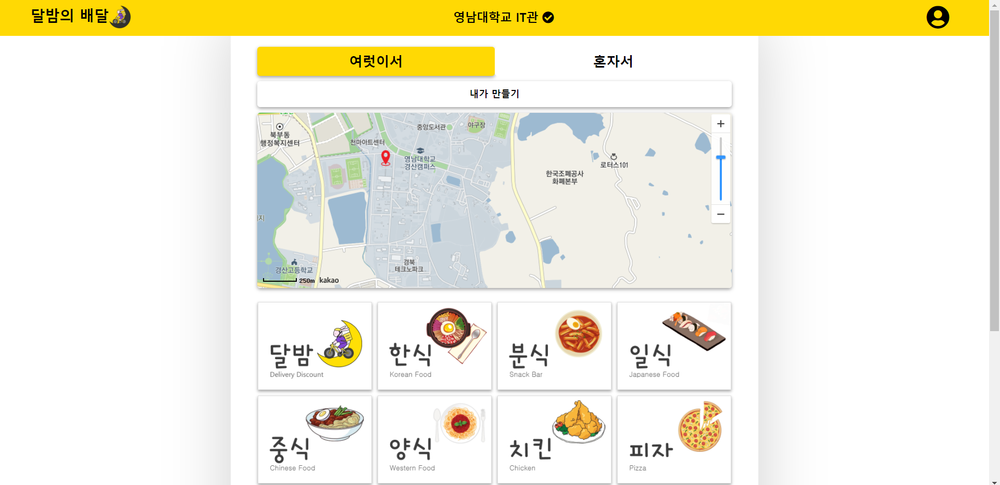

# Like Lion IdeaTon ~7.4
## Idea
* 1인가구가 증가함에 따라 배달수요도 1인가구가 중심이 되고 있음.
* 대부분의 가게는 최소주문 금액 및 배달비를 요구하고 있음.
* 1인가구 입장에서는 배달비가 부담스러움
* 공동 목적지로 공동배달을 하면 배달비가 줄어들지 않을까?

## future plans   
> 2021.6.24   
> ~~1. 아이디어 회의 및 선택~~  
>     
> 2021 6.26  
> ~~1. 아이디어 재선정~~  
>   
> 2021 6.27   
> ~~1. 아이디어 구체회~~
> ~~2. service flow 구체화.~~   
> ~~3. 발표자료 준비.~~   
> ~~4. 구성할 페이지 회의.~~  
>   
> 2021.7.1    
> ~~1. 상단의 영남대학교 IT관 밑줄 그어진거 없애기.~~  
> ~~2. 메뉴 리스트 왼쪽 오른쪽 마진이 맞지가 않음.~~      
> ~~3. 맵은 이미지로 사용하고 확대 축소가 가능하도록.~~   
> ~~4. 한식 -> 배달 시간 순 버튼 눌럿을 때 노란색 표시.~~   
> ~~5. 메뉴 버튼 활성화~~    
> ~~6. marker이미지 바꾸기.~~   
> ~~7. it관 기준으로 map 설정.~~  

## my work
* bootstrap 흰색 버튼 삭제
* nav-bar와 form-wrap 사이의 빈 공간 삭제
* 아래 공간 삭제
* pagination 구현
* url 연결
* javascript를 사용한 이벤트 제어
* kakao map api 사용   
* 메뉴 선택 이벤트 추가(jQuery,js)    

## results
### login page
   

### location page    
   

### mainmenu page   
   

### main page     
   

### menu selection page   
   

### 결제창   
   

### 내가 만들기   
   

### 내가 만들기 결제창   
   

